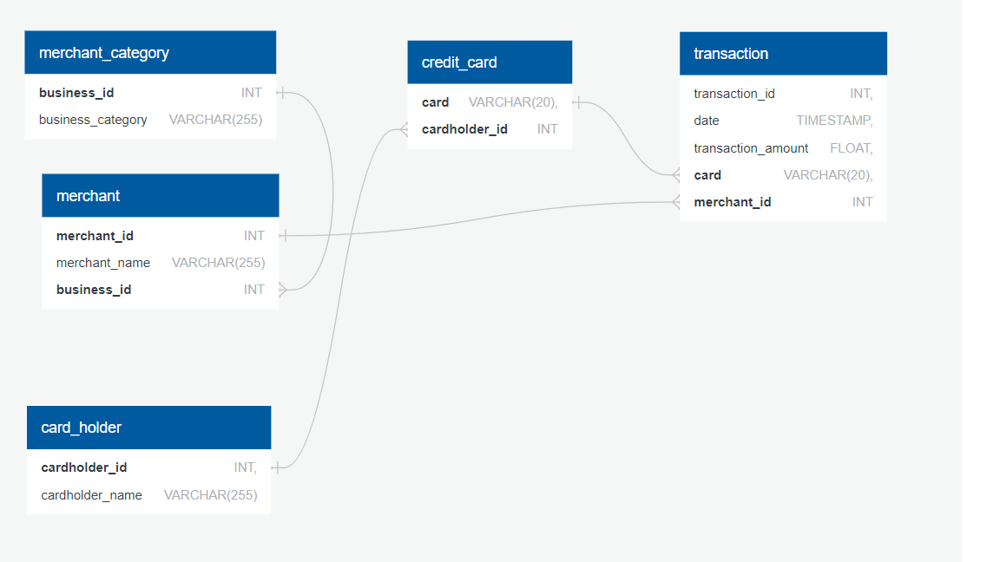

# Credit Card Fraud Detection

After data modeling, PostgreSQL, Python and Pandas are used to create a database and look for outliers to detect credit card fraud. This was a homework assignment under Northwestern's Fintech Bootcamp.

## Getting Started

This project was done on a Jupyter notebook, which means there is no need to run this as an "app". A Jupyter notebook contains python code and displays the results of the code on the same page when running on a local computer with all dependencies installed. But no need to install libraries. Just open up the ".ipynb" file in the repository and it shows the Python code with its immediate results. In this case the dataframes are shown but for some reason the plots are not shown, so they are right here on the Readme file. 

If actually running the jupyter notebook is desired, then install all necessary libraries with "pip install 'x'" where 'x' is:
- sqlalchemy
- pandas
- calendar
- hvplot

## Project Overview
First a relationship was established from exploring various SQL files located in the Data folder. Relationships were found between the tables and a Quick Database Diagram was drawn:

Then the database was made using PostgreSQL on a local machine. After that, data was pulled and analyzed using Python and Pandas. 

In this assignment, we first investigated whether cardholders 2 and 18 were hacked. We cleaned up the data so that only their transactions were shown and plotted them against each other. Due to sudden bursts of expenditure in cardholder 18, it was found to be suspect:

## Background
Fraud is prevalent these days, whether you are a small taco shop or a large international business. While there are emerging technologies that employ machine learning and artificial intelligence to detect fraud, many instances of fraud detection still require strong data analytics to find abnormal charges.

In this homework assignment, you will apply your new SQL skills to analyze historical credit card transactions and consumption patterns in order to identify possible fraudulent transactions.

You are asked to accomplish three main tasks:

 Data Modeling: Define a database model to store the credit card transactions data and create a new PostgreSQL database using your model.
 Data Engineering: Create a database schema on PostgreSQL and populate your database from the CSV files provided.
 Data Analysis: Analyze the data to identify possible fraudulent transactions trends data, and develop a report of your observations.

## Instructions

### Data Modeling
Create an entity relationship diagram (ERD) by inspecting the provided CSV files. Part of the challenge here is to figure out how many tables you should create, as well as what kind of relationships you need to define among the tables. Feel free to discuss your database model design ideas with your classmates. You can use a tool like Quick Database Diagrams (Links to an external site.) to create your model.

### Data Engineering
Using your database model as a blueprint, create a database schema for each of your tables and relationships. Remember to specify data types, primary keys, foreign keys, and any other constraints you defined. After creating the database schema, import the data from the corresponding CSV files.

### Data Analysis
Your CFO has also requested detailed trends data on specific card holders. Use the starter notebook to query your database and generate visualizations that supply the requested information as follows, then add your visualizations and observations to your markdown report:

The two most important customers of the firm may have been hacked. Verify if there are any fraudulent transactions in their history. For privacy reasons, you only know that their cardholder IDs are 2 and 18.
Using hvPlot, create a line plot representing the time series of transactions over the course of the year for each cardholder separately.

Next, to better compare their patterns, create a single line plot that contains both card holders' trend data.

What difference do you observe between the consumption patterns? Does the difference suggest a fraudulent transaction? Explain your rationale.
The CEO of the biggest customer of the firm suspects that someone has used her corporate credit card without authorization in the first quarter of 2018 to pay quite expensive restaurant bills. Again, for privacy reasons, you know only that the cardholder ID in question is 25.
Using hvPlot, create a box plot, representing the expenditure data from January 2018 to June 2018 for cardholder ID 25.

Are there any outliers for cardholder ID 25? How many outliers are there per month?

Do you notice any anomalies? Describe your observations and conclusions.

